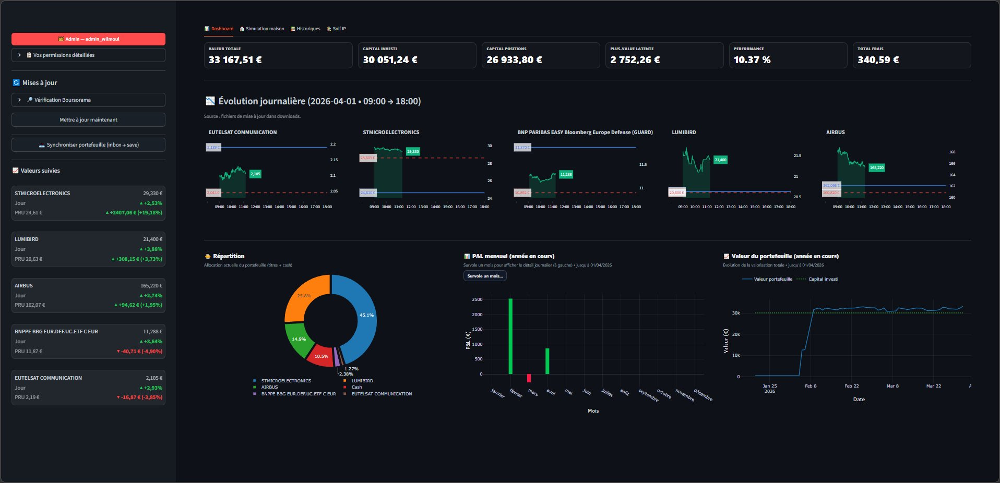
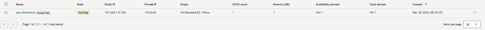
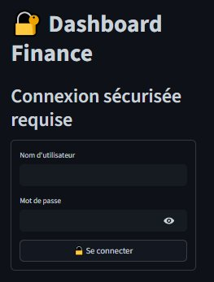
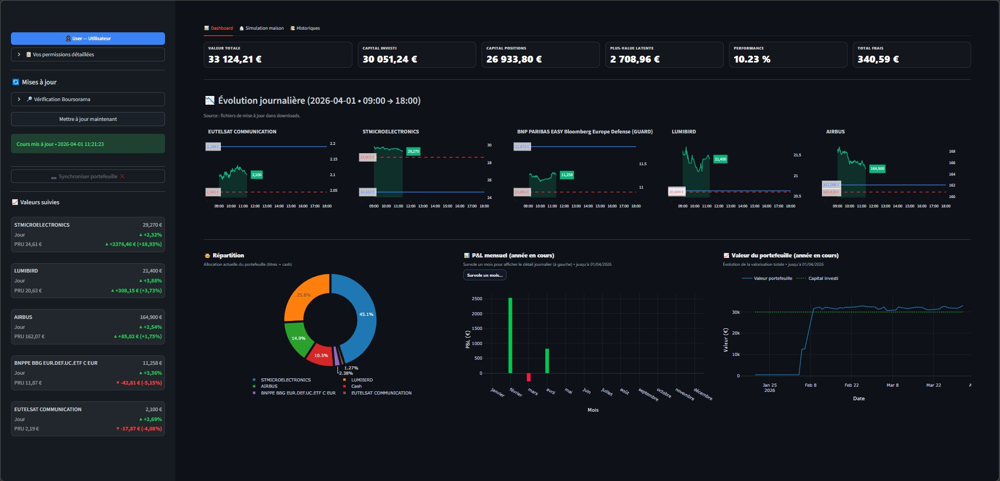

# 📈 Déploiement Dashboard — Veille Financière & Boursière

Dashboard de veille financière destiné aux **particuliers** souhaitant suivre leur portefeuille boursier et piloter leur situation financière personnelle. Il permet de visualiser l'évolution de ses investissements en temps réel, de consulter l'historique de ses opérations broker, et d'accéder à des outils de simulation financière — comme par exemple le calcul de remboursement d'un crédit immobilier (montant, durée, taux, mensualités) directement depuis le dashboard.

> ⚠️ Le portefeuille présenté est **entièrement fictif** et sert uniquement d'exemple pour illustrer les fonctionnalités du dashboard. Les valeurs, titres et données financières affichés ne correspondent à aucune situation réelle et ne constituent pas des conseils d'investissement.

Le tout est déployé sur **Oracle Cloud Free Tier**, accessible via HTTPS sous le domaine **DataOz**, avec gestion des accès par rôles utilisateurs.

🔗 **[https://dashboard.dataoz.fr](https://dashboard.dataoz.fr)**

---

## 🖥️ Aperçu

### Page de connexion

### Vue Administrateur

### Vue Utilisateur

### Vue Visiteur

---

## 🔑 Accès de démonstration

Un accès visiteur est disponible pour consulter le dashboard en lecture seule :

| Rôle | Identifiant | Mot de passe |
|------|-------------|--------------|
| 👁️ Visiteur | `guest` | `Externe1234` |

> Les accès Admin et Utilisateur ne sont pas exposés publiquement.

> ⚠️ Les valeurs financières, titres et données du portefeuille visibles sur le dashboard sont **entièrement fictifs** et ont été ajoutés à titre de démonstration uniquement. Ils ne constituent en aucun cas des données réelles ou des conseils d'investissement.

---

## 🏗️ Architecture

Le frontend (Streamlit) et le backend (Python `core/`) sont hébergés sur la même instance Oracle Cloud. Les données sont stockées sous forme de fichiers plats (`.txt`, `.csv`, `.json`), sans base de données.

---

## 🔐 Processus de connexion & rôles utilisateurs

L'accès au dashboard passe par une page de login protégée. Chaque utilisateur se connecte avec un identifiant et un mot de passe. Selon son rôle, il accède à un périmètre fonctionnel différent.

### Rôles et permissions

| Fonctionnalité | 👑 Admin | 👤 User | 👁️ Viewer |
|---|:---:|:---:|:---:|
| Consulter le dashboard | ✅ | ✅ | ✅ |
| Lien Boursorama sur les valeurs du portefeuille | ✅ | ✅ | ✅ |
| Mise à jour manuelle des données | ✅ | ✅ | ✅ |
| Vérification connexion site Boursorama | ✅ | ✅ | ✅ |
| Accès historiques fichiers broker | ✅ | ✅ | ❌ |
| Simulation de remboursement crédit | ✅ | ✅ | ❌ |
| Synchronisation des fichiers broker | ✅ | ❌ | ❌ |
| Configurer les sources scrapées | ✅ | ❌ | ❌ |
| Gérer les utilisateurs | ✅ | ❌ | ❌ |
| Consulter les logs système | ✅ | ❌ | ❌ |

La navigation dans Streamlit s'adapte dynamiquement au rôle détecté à la connexion : les pages non autorisées ne sont pas affichées et tout accès direct est bloqué côté serveur.

---

## 🛡️ Sécurisation des accès

La sécurité repose sur **trois couches successives et indépendantes** :

**Couche 1 — Réseau (Nginx)**

Seules les adresses IP présentes dans une liste blanche peuvent atteindre le serveur. Toute autre requête est rejetée avec un `403 Forbidden` avant même d'afficher la page de login. La whitelist est stockée dans un **fichier JSON** lu dynamiquement par Nginx, avec trois modes d'ajout selon le niveau de rôle cible :

- **Admin** — adresse IP ajoutée **manuellement en dur** dans le fichier JSON directement sur le serveur, par l'administrateur système.
- **Analyst** — adresse IP ajoutée via une **demande d'approbation traitée par l'admin depuis le dashboard** (interface dédiée dans Streamlit).
- **Viewer** — adresse IP ajoutée **automatiquement** lors de la première connexion valide, sans intervention humaine.

**Couche 2 — Authentification**

Les mots de passe sont stockés sous forme hachée (bcrypt, irréversible). Le formulaire de login renvoie un message d'erreur générique quel que soit le cas d'échec, afin d'éviter toute énumération des comptes existants. La session est maintenue côté serveur et expirée automatiquement.

**Couche 3 — Autorisation par rôle**

Chaque page et chaque action du backend vérifie le rôle de l'utilisateur connecté avant d'autoriser l'accès. Un viewer ne peut pas accéder aux données brutes même en manipulant l'URL. Toutes les variables sensibles (clés, credentials) sont stockées dans des fichiers de configuration non versionnés, jamais dans le code source.

---

## 🤖 Scraping & éthique

La collecte de données boursières est réalisée via **Playwright** (navigateur headless) qui se connecte à **Boursorama.com** pour télécharger les cours des valeurs du portefeuille. Les fichiers broker (positions, historique, ordres) sont synchronisés depuis la messagerie. Tout est stocké sous forme de fichiers plats (`.txt`, `.csv`, `.json`) sans base de données.

La collecte est réalisée dans le respect des bonnes pratiques du scraping responsable :

- **Délai entre les requêtes** — un temps d'attente est respecté entre chaque collecte afin de ne pas saturer les serveurs.
- **Pas de surcharge serveur** — les collectes sont planifiées via cron avec un nombre de requêtes volontairement limité par session.
- **Données à usage personnel** — les données collectées sont utilisées uniquement à des fins de traitement interne pour un projet à but non lucratif.

---

## ☁️ Hébergement — Oracle Cloud Free Tier

Le projet tourne sur une instance **VM.Standard.E2.1.Micro** d'Oracle Cloud, entièrement gratuite et permanente (1 OCPU, 1 Go de RAM, 50 Go de stockage). L'absence de base de données relationnelle et le choix de Streamlit comme frontend permettent de rester dans les limites mémoire de cette instance. Un fichier swap de 2 Go absorbe les pics de charge. Les services sont gérés par systemd pour assurer le redémarrage automatique.

Le certificat HTTPS est fourni par **Let's Encrypt** via Certbot, avec renouvellement automatique, et exposé sous le sous-domaine **DataOz**.

---

*Portfolio — Dashboard Cloud © 2025*
